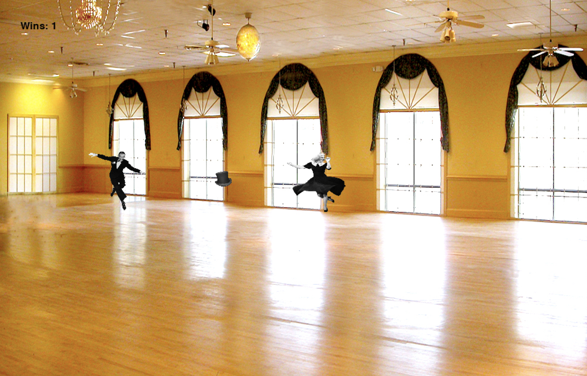
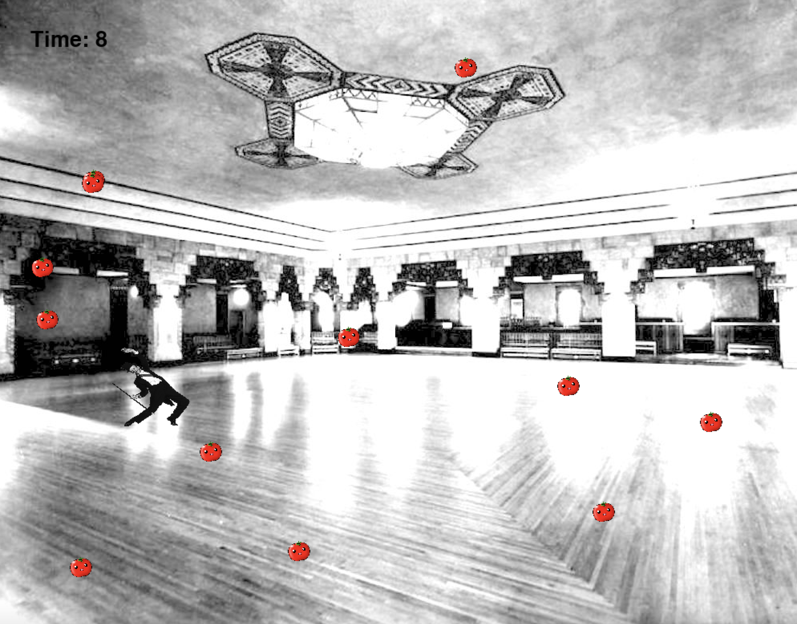
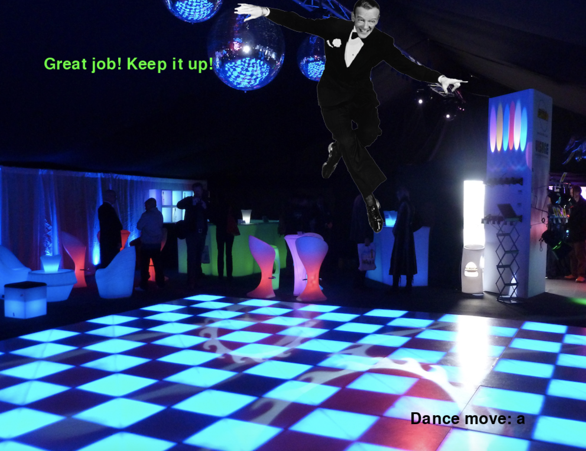

## Catch Fred
Catch Fred is a 3 level game wherein Fred Astaire collects tophats while avoiding Ginger Rogers, dodges tomatoes, and dances.

## Github Link:
[Catch Fred](https://www.github.com/eddieatkinson/dancing_game)

## Technologies used:
**Languages:**
* Python

**Frameworks:**
* Pygame

## Code snippets:
Main player (Fred):
``` python
class Player(Sprite):
    def __init__(self, image, start_x, start_y, screen):
        super(Player, self).__init__()
        self.image = pygame.image.load(image)
        self.image = pygame.transform.scale(self.image, (100, 100))
        self.x = start_x
        self.y = start_y
        self.speed = 10
        self.wins = 0
        self.rect = self.image.get_rect()
        self.screen = screen
        self.should_move_up = False
        self.should_move_down = False
        self.should_move_right = False
        self.should_move_left = False

    def draw_me(self):
        if self.should_move_up:
            self.y -= self.speed
        elif self.should_move_down:
            self.y += self.speed
        if self.should_move_right:
            self.x += self.speed
        if self.should_move_left:
            self.x -= self.speed
        self.rect.left = self.x
        self.rect.top = self.y
        self.screen.blit(self.image, [self.x, self.y])

    def should_move(self, direction, yes_or_no):
        if (direction == "up"):
            self.should_move_up = yes_or_no
        if (direction == "down"):
            self.should_move_down = yes_or_no
        if (direction == "right"):
            self.should_move_right = yes_or_no
        if (direction == "left"):
            self.should_move_left = yes_or_no

    def got_coins(self):
        self.wins += 1

    def change_image(self, image, width, height):
        self.image = image
        self.image = pygame.transform.scale(self.image, (width, height))

    def new_position(self, new_x, new_y):
        self.x = new_x
        self.y = new_y

    def stay_still(self):
        self.speed = 0

    def speed_up(self):
        self.speed += 1
```
Villain (Ginger):
``` python
class Villain(Sprite):
    def __init__(self, screen):
        super(Villain, self).__init__()
        self.image = pygame.image.load("ginger.png")
        self.image = pygame.transform.scale(self.image, (100, 100))
        self.x = 800
        self.y = 400
        self.screen = screen
        self.speed = 4
        self.rect = self.image.get_rect()
    def update_me(self, player):
        dx = self.x - player.x
        dy = self.y - player.y
        dist = hypot(dx, dy)
        dx = dx / dist
        dy = dy / dist
        self.x -= dx * self.speed
        self.y -= dy * self.speed
        self.rect.left = self.x
        self.rect.top = self.y

    def draw_me(self):
        self.screen.blit(self.image, [self.x, self.y])

    def speed_up(self):
        self.speed += 1
```
Tophats:
``` python
class Coins(Sprite):
    def __init__(self, screen, start_x, start_y):
        super(Coins, self).__init__()
        self.screen = screen
        self.image = pygame.image.load('tophat.png')
        self.image = pygame.transform.scale(self.image, (45, 45))
        self.rect = self.image.get_rect()
        self.x = start_x
        self.y = start_y

    def update_coins(self):
        self.x = randint(0, 955)
        self.y = randint(0, 755)

    def draw_coins(self):
        self.rect.left = self.x
        self.rect.top = self.y
        self.screen.blit(self.image, [self.x, self.y])
```
Tomatoes:
``` python
class Bullet(Sprite):
    def __init__(self, screen, player, speed):
        super(Bullet, self).__init__()
        self.image = pygame.image.load("tomato.png")
        self.image = pygame.transform.scale(self.image, (30, 30))
        self.x = 1000
        self.y = randint(0, 795)
        self.screen = screen
        self.rect = self.image.get_rect()
        self.speed = speed

    def update(self):
        self.x -= self.speed #change the y, each time update is run, by bullet speed
        self.rect.left = self.x
        self.rect.top = self.y

    def draw_bullet(self):
        self.screen.blit(self.image, [self.x, self.y])
```
Ginger crashing and tophat-collecting:
``` python
ginger_crash = groupcollide(players, villains, False, False)
        if ginger_crash and win:
            screen.blit(lose_text, [100, 100])
            player.stay_still()
            pygame.mixer.Sound.play(ouch)
            player.change_image(pygame.image.load("tombstone.png"), 100, 100)
            win = False
            lost()
        tophat_crash = groupcollide(players, coins, False, False)
        if tophat_crash:
            coin.update_coins()
            player.got_coins()
            villain.speed_up()
            player.speed_up()
            pygame.mixer.Sound.play(yeah)
```
Tomato-hit:
``` python
    got_shot = groupcollide(players, bullets, False, True)
    if got_shot:
        screen.blit(lose_text, [100, 100])
        player.stay_still()
        pygame.mixer.Sound.play(ouch)
        shot = True
```
Matching dance-moves:
``` python
        while not correct_move: 
            for event in pygame.event.get():
                if event.type == pygame.QUIT:
                    quit()
                if event.type == pygame.KEYDOWN:
                    if event.key == keys[dance_moves[move]]:
                        correct_text_msg = "Great job! Keep it up!"
                        correct_move = True
                        old_img_counter = img_counter
                        img_counter = randint(0, 3)
                        if old_img_counter == img_counter:
                            img_counter -= 1
                    else:
                        correct_move = False
                        img_counter = 4
                        correct_text_msg = "Try again!"
                        correct_text = font_move.render("%s" % correct_text_msg, True, (255, 0, 0))
                        screen.blit(correct_text, [80, 100])
                        player.change_image(pygame.image.load(level3_img[img_counter]), 400, 400)
                        player.draw_me()
                        num_incorrect += 1          
            if num_incorrect == 10:
                game_over_text = font_move.render("Game over!", True, (255, 255, 255))
                screen.blit(game_over_text, [400, 100])
            pygame.display.flip()
```
## Screenshots:


